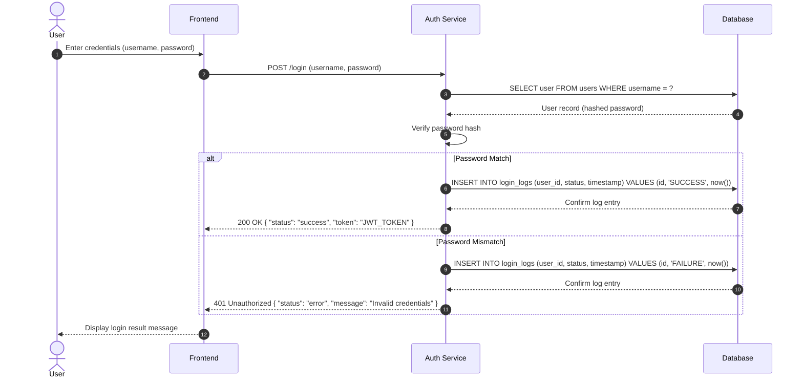

# REST API :: GET user by id

## Business flow of API
1. Client sends a GET request to /api/users/:id with a valid JWT token in the HTTP header.
2. Server checks the JWT token for validity.
3. If the token is valid, the server retrieves the user information from the database using the provided id.
4. If the user is found, the server responds with a 200 status code and the user information in JSON format.
5. If the user is not found, the server responds with a 404 status code and an error message.
6. If there is an internal server error, the server responds with a 500 status code and an error message.

## API Spec
* GET /api/users/:id
* Check JWT token from HTTP header

* Code=200
{
    "id": 1,
    "name": "John Doe",
    "email": "john.doe@example.com"
}

* Code=404
{
    "error": "User not found"
}

* Code=500
{
    "error": "Internal server error"
}

## Database design
* Table: users
| Column | Type | Description |
|--------|------|-------------|
| id     | INT  | Primary key, auto-increment | 
| name   | VARCHAR(255) | User's name |
| email  | VARCHAR(255) | User's email |
| created_at | TIMESTAMP | Timestamp of when the user was created |

## Test Cases show in table format
| Test Case ID | Description | Input | Expected Output | Status |
|--------------|-------------|-------|-----------------|--------|
| TC_01 | Valid user ID | GET /api/users/1 with valid JWT | 200 OK | { "id": 1, "name": "John Doe", "email": "john.doe@example.com" } | Passed |
| TC_02 | Invalid user ID | GET /api/users/999 with valid JWT | 404 Not Found | { "error": "User not found" } | Passed |
| TC_03 | Missing JWT token | GET /api/users/1 without JWT | 401 Unauthorized | { "error": "Unauthorized" } | Passed |
| TC_04 | Invalid JWT token | GET /api/users/1 with invalid JWT | 401 Unauthorized | { "error": "Unauthorized" } | Passed | 401 Unauthorized | { "error": "Unauthorized" } | Passed | 
| TC_05 | Internal server error | Simulate database failure | 500 Internal Server Error | { "error": "Internal server error" } | Passed |